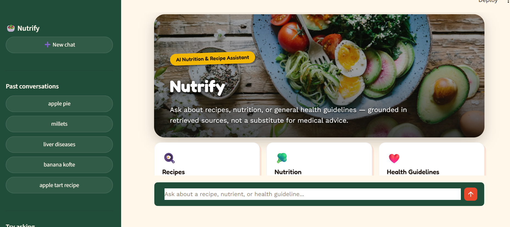
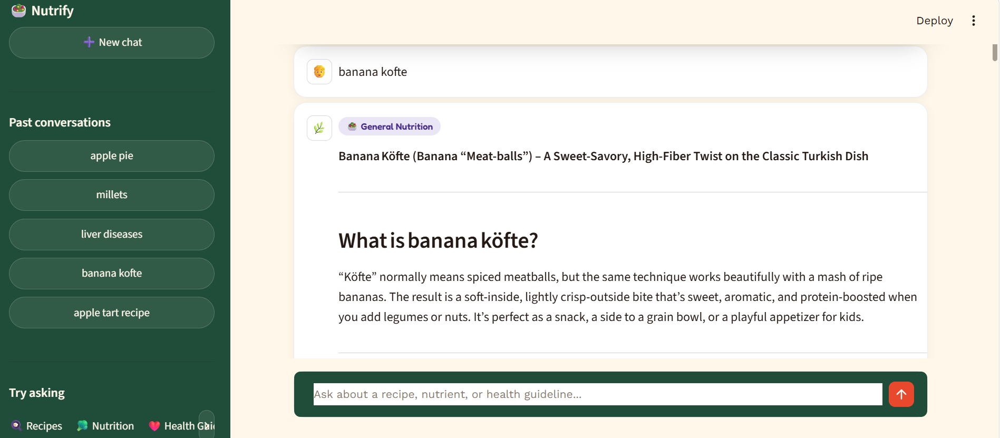
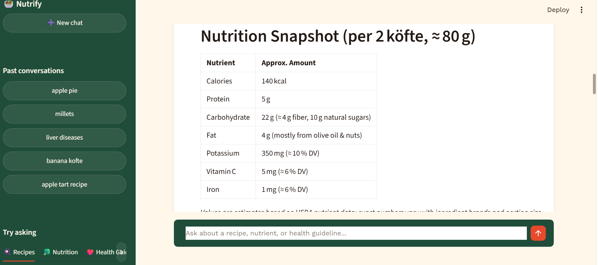
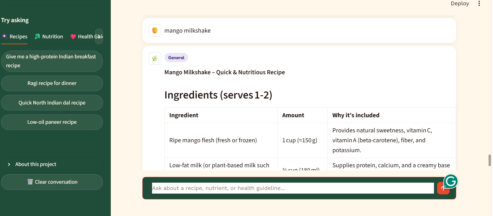
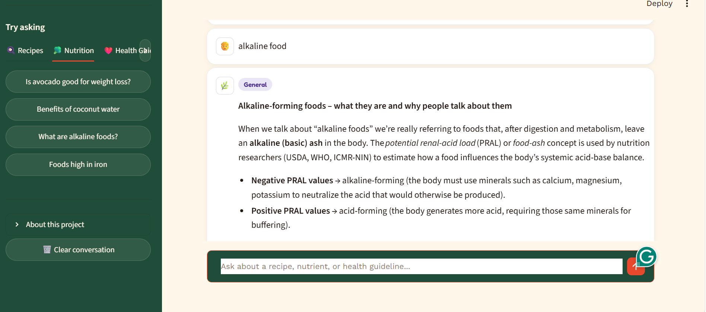
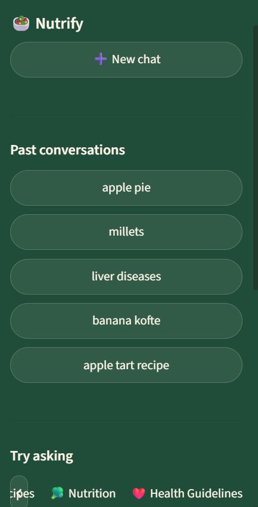
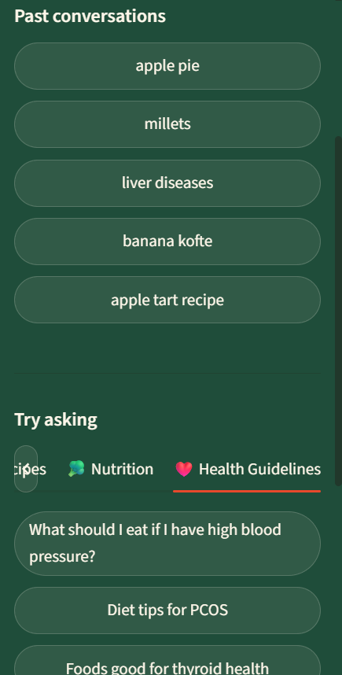

# 🥗 Nutrify — AI Health & Nutrition Assistant
🔗 **Live demo:** https://nutrify-jiya.streamlit.app

A retrieval-augmented generation (RAG) chatbot that answers recipe, nutrition, and health guideline questions, grounded in a curated knowledge base spanning **US and Indian cuisine** and **public health nutrition guidance** (USDA, CDC, WHO, and ICMR-NIN).

Built as an end-to-end project covering data engineering, embeddings, vector search, LLM integration, safety guardrails, evaluation, and a custom UI.



---

## Features

- **Dual-cuisine recipe retrieval** — 5,000 US recipes (Food.com) + 3,000 Indian recipes (regional cuisine dataset, with emphasis on North Indian states)
- **12 health guideline documents** covering general nutrition (USDA/CDC/WHO), Indian dietary guidelines (ICMR-NIN), and condition-specific guidance: diabetes, hypertension, PCOS, thyroid, anemia, heart disease, liver health
- **Safety guardrails** — declines diagnostic or prescriptive medical questions and redirects to a healthcare professional
- **Robust to typos/ambiguity** — correctly interprets misspelled or abbreviated health terms (e.g., "ocos" → PCOS)
- **General knowledge fallback** — supplements retrieved context with the underlying LLM's own nutrition knowledge when the exact match isn't in the database, rather than refusing
- **8,076 indexed chunks** in a local vector store (ChromaDB)

---

## Screenshots

### Chat in action

| Recipe answer: banana köfte | Nutrition breakdown table |
|---|---|
|  |  |
| **Recipe with ingredients table: mango milkshake** | **Nutrition question: alkaline foods** |
|  |  |

### Sidebar: chat history and suggested questions

<p align="center">
  
  &nbsp;&nbsp;
  
</p>

---

## Architecture

```
User Query
    │
    ▼
Sentence-Transformers Embedding (all-MiniLM-L6-v2)
    │
    ▼
ChromaDB Vector Search (top-8 relevant chunks)
    │
    ▼
Groq LLM (openai/gpt-oss-120b) + System Prompt + Retrieved Context
    │
    ▼
Streamlit Chat UI
```

**Data sources:**
| Source | Content | Size |
|---|---|---|
| Food.com Recipes | US recipes (name, ingredients, steps, time) | 5,000 sampled |
| Cleaned Indian Recipes Dataset | Indian regional recipes | 3,000 sampled (1,092 North Indian-focused) |
| USDA / CDC / WHO guidance | General nutrition guidelines | 7 documents |
| ICMR-NIN guidance | Indian dietary guidelines + disease-specific docs | 5 documents |

---

## Tech Stack

- **Language model**: Groq API (`openai/gpt-oss-120b`)
- **Embeddings**: `sentence-transformers` (`all-MiniLM-L6-v2`, runs locally, no API cost)
- **Vector store**: ChromaDB (persistent, local)
- **Chunking**: LangChain `RecursiveCharacterTextSplitter`
- **UI**: Streamlit
- **Data processing**: pandas

---

## Setup

### 1. Clone and install dependencies
```bash
pip install groq python-dotenv langchain langchain-text-splitters pandas sentence-transformers chromadb streamlit
```

### 2. Add your API key
Create a `.env` file in the project root:
```
GROQ_API_KEY=your_key_here
```
Get a free key at [console.groq.com](https://console.groq.com).

### 3. Build the knowledge base
```bash
python prepare_recipes.py
python prepare_indian_recipes_v2.py
python prepare_documents.py
python build_vectorstore.py
```

### 4. Run the app
```bash
streamlit run app.py
```

---

## Evaluation

A structured evaluation set of 17 test cases across 12 categories (recipe retrieval, guideline grounding, disease-specific guidance, safety guardrails, typo handling, and out-of-scope detection) was used to validate behavior.

**Result: 17/17 test cases passed.**

See [EVALUATION.md](./EVALUATION.md) for the full results table and methodology.

To re-run the evaluation:
```bash
python evaluation_set.py
python summarize_evaluation.py
```

---

## Design Decisions & Debugging Notes

- **Why RAG over fine-tuning**: retrieval keeps the knowledge base easily updatable (adding new recipes/guidelines requires no retraining) and keeps answers traceable to real sources.
- **Why a subsampled dataset (5k US + 3k Indian recipes) instead of the full ~230k**: embedding time and free-tier rate limits scale with dataset size; a well-sampled subset covering diverse cuisines and dietary needs demonstrates the architecture without unnecessary cost. The pipeline scales to the full dataset with more compute time.
- **Why `openai/gpt-oss-120b` over the smaller 20B model**: the 20B model exhibited an over-refusal bias, declining reasonable questions (e.g., "is avocado good for PCOS") whenever the exact wording wasn't in retrieved context, even when clearly capable of answering from general knowledge. The 120B model, noted by Groq for stronger health-domain reasoning, resolved this with the same prompt.
- **A subtle bug worth noting**: mid-development, prompt and model changes appeared to have no effect on output. The cause was Streamlit/Python module caching — `rag_pipeline.py` is only imported once when the server starts, so edits to it require a full server restart (not just a browser refresh) to take effect. This is a good example of distinguishing a prompt-engineering problem from an application-layer bug.

---

## Known Limitations

- Free-tier LLM (`gpt-oss-120b` via Groq) can occasionally be inconsistent in tone/formatting across similar queries.
- Indian recipe/guideline coverage, while substantially expanded, is not exhaustive of all Indian states or regional cuisines.
- General knowledge fallback answers (for topics outside the indexed data) are not source-cited the way guideline-grounded answers are.
- Not intended for medical use — the assistant provides general nutrition information only.

---

## Project Structure
```
health-nutrition-assistant/
├── app.py                          # Streamlit UI
├── rag_pipeline.py                 # Retrieval + LLM logic
├── build_vectorstore.py            # Embeds chunks into ChromaDB
├── prepare_documents.py            # Chunks recipes + guidelines
├── prepare_recipes.py              # US recipe sampling
├── prepare_indian_recipes_v2.py    # Indian recipe sampling (region-weighted)
├── evaluation_set.py               # Automated evaluation runner
├── summarize_evaluation.py         # Evaluation results summary
├── EVALUATION.md                   # Evaluation results & methodology
├── data/
│   ├── raw/                        # Source CSVs
│   └── guidelines/                 # 12 health guideline text documents
└── vectorstore/                    # Persistent ChromaDB store
```

---

## Disclaimer
This assistant provides general nutrition and health information for educational purposes. It is not a substitute for professional medical advice, diagnosis, or treatment.
